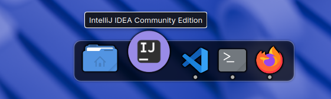

# Custom Dock for KDE Plasma 6

A sleek, customizable dock plasmoid for KDE Plasma 6 with macOS-like icon magnification effects, drag-and-drop icon management, and window tracking.



## Features

### Core Functionality
- **Icon Magnification**: Smooth scaling animation when hovering over icons with configurable influence radius
- **Drag & Drop**: Add applications by dragging `.desktop` files from your application menu or file manager
- **Icon Reordering**: Drag icons left or right to rearrange them in the dock
- **Remove Icons**: Drag icons out of the dock to remove them
- **Persistent Configuration**: Your pinned applications are saved and restored across sessions

### Window Management
- **Running Indicators**: Gray dots appear below icons of running applications
- **Smart Launch**: Click an icon to launch the app, or focus its window if already running
- **Window Activation**: Automatically detects and focuses existing windows instead of launching duplicates

### Visual Design
- **Smooth Animations**: Scaling, displacement, and transition effects
- **Adaptive Sizing**: Dock automatically adjusts width based on number of icons

## Installation

### From Source

1. Clone or download this repository
2. Copy to your local plasmoids directory:
```bash
cp -r org.kde.plasma.customdock ~/.local/share/plasma/plasmoids/
```

3. Restart Plasma Shell:
```bash
kquitapp6 plasmashell && plasmashell --replace &
```

4. Add the widget:
   - Right-click on your panel → "Add Widgets"
   - Search for "Custom Dock"
   - Drag it to your panel

## Usage

### Adding Applications
- **Method 1**: Drag `.desktop` files from Application Menu onto the dock
- **Method 2**: Drag `.desktop` files from `/usr/share/applications/` using Dolphin

### Managing Icons
- **Reorder**: Click and drag an icon horizontally to reposition it
- **Remove**: Drag an icon away from the dock and drop it outside
- **Launch**: Click an icon to launch the application
- **Focus**: Click a running application's icon to bring its window to focus

### Configuration
The dock stores your pinned applications in:
```
~/.config/plasma-org.kde.plasma.desktop-appletsrc
```

## Architecture

```
contents/ui/
├── main.qml                      # Root component, orchestration & persistence
├── DockContainer.qml             # Visual container, ListView, animations
├── DockIcon.qml                  # Individual icon with drag/scale/hover logic
├── TaskManagerIntegration.qml    # Window tracking & app launching
└── DesktopFileReader.qml         # .desktop file parser
```

## Technical Details

### Dependencies
- KDE Plasma 6

### Adding Features
1. Keep components modular and single-responsibility
2. Use signals for cross-component communication
3. Prefer property bindings over imperative updates
4. Test drag operations and animations thoroughly

## License

This project is free software; you can redistribute it and/or modify it under the terms of your preferred open source license.
